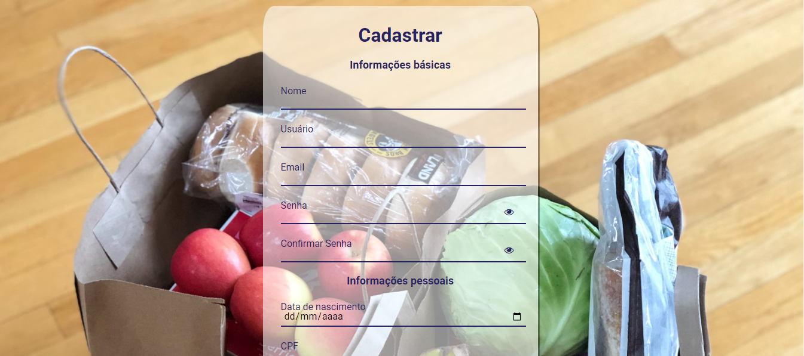
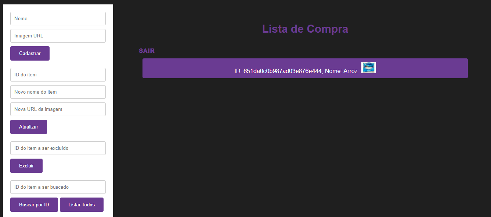

# Sistema de Gerenciamento de Itens de Compras

Um sistema de gerenciamento de itens de compras que permite criar, listar, editar e excluir itens usando uma API e tanbém o local Storage do navegador.

## Descrição

Este projeto consiste em um sistema de gerenciamento de itens que interage com uma API para criar, listar, editar e excluir itens. Ele foi desenvolvido em JavaScript,HTML e CSS, e faz uso de recursos como o Local Storage para armazenamento temporário dos itens e a API do crudcrud.

https://crudcrud.com/

## Requisitos

Certifique-se de ter os seguintes requisitos antes de usar o sistema:

- Navegador da Web moderno (como Chrome, Firefox, etc.).
- Acesso à internet (para interação com a API).
- A Api faz somente 100 requisições após isso é necessário mudar o link da API.

## Configuração

1. Clone este repositório:

   ```bash
   git clone https://github.com/ErivaldoCapitulino/listaComprasSantaderCode.git
   cd seu-projeto
   ```

2. Abra o arquivo `index.html` em um navegador da web.

## Uso

1. Após configurar o projeto, abra o `index.html` no seu navegador.

2. Use o sistema para criar, listar, editar e excluir itens.

3. Certifique-se de preencher todos os campos necessários ao criar um novo item.

4. Você pode clicar no botão de "Excluir" para remover um item existente.

5. Clique em um item na lista para selecioná-lo para edição.

6. Use o botão "Atualizar" para salvar as edições em um item selecionado.

## Contribuição

Você pode contribuir para este projeto abrindo problemas (issues) ou enviando solicitações de pull (pull requests). Certifique-se de seguir as diretrizes de contribuição do projeto.

<br><br>
<br><br>
